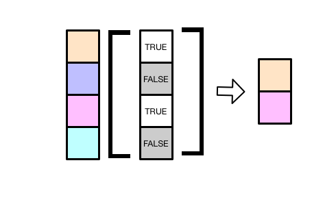

子集选取的意思是，从全集中选取一部分，比如从一个向量中选一部分元素，或者从数据框中选
出某几列。


## 向量

对于原子型向量(vector)，我们有至少四种方法取子集
```{r}
x <- c(1.1, 2.2, 3.3, 4.4, 5.5)
```


- 正整数：位置索引，用于指定向量中元素所在的位置，第一个位置是1
```{r}
x[1]
```


```{r}
x[3:4]
```


```{r}
x[c(1, 3)]
```


```{r}
x[c(3, 1)]
```


```{r}
x[c(1, 2, 1, 1)]
```


```{r}
x[length(x)]   # 提取向量最后一个元素
```

**课堂练习**，提取倒数第二个元素


- 负整数：删除指定位置的元素
```{r}
x[-2]
```


- 逻辑向量：通过一个等长的逻辑向量，将`TRUE`对应位置的元素提取出来

```{r, out.width = '80%', echo = FALSE}

```


```{r}
x <- c(1.1, 2.2, 3.3, 4.4, 5.5)

x[c(TRUE, FALSE, TRUE, FALSE, TRUE)]
```


**课堂练习**，结果会是什么？
```{r}
x <- c(1.1, 2.2, 3.3, 4.4, 5.5)

x[c(TRUE, FALSE)] 
```


```{r}
x <- c(1.1, 2.2, 3.3, 4.4, 5.5)

x[x > 4]    # 选取向量中大于4的元素
```

**课堂练习**，找出向量中大于4或者小于2的元素


- 如果是命名向量
```{r}
y <- c("a" = 11, "b" = 12, "c" = 13, "d" = 14)
y
```

我们可以用名字向量，返回对应位置的向量
```{r}
y[c("d", "c", "a")]
```


- 子集赋值
```{r}
x <- c(1.1, 2.2, 3.3, 4.4, 5.5)
x[3] <- 9
x
```

**思考**，如何将x中大于4的元素全部替换成 9 ?


## 列表

对列表取子集，和向量的方法一样。 向量的子集仍然是向量，使用`[`提取列表的子集，总是返回列表。
```{r}
l <- list(
  "one"   = c("a", "b", "c"),
  "two"   = c(1:5),
  "three" = c(TRUE, FALSE)
)
l
```

使用位置索引
```{r}
l[1]
```


```{r}
l[c(1, 3)]
```


也可以使用元素名
```{r}
l["one"]
```


```{r}
l[c("one", "three")]
```


如果想列表元素的值，需要使用`[[`
```{r}
l[[1]]
```

也可以使用其中的元素名，
```{r}
l[["one"]]
```


### 更简洁的办法

取出`one`位置上的元素，需要写`[["one"]]`，程序员觉得太麻烦了，所以用`$`来简写
```{r}
l$one
```

所以请记住
- `[` 和`[[`的区别
-`x$y` 是 `x[["y"]]`的简写


 
## 矩阵

```{r}
a <- matrix(1:9, nrow = 3)
a
```

我们取第1到2行的2-3列，`[1:2, 2:3]`，中间以逗号分隔，于是得到一个新的矩阵
```{r}
a[1:2, 2:3]
```


有些时候，我们想保留所有的行或者列，比如这里我们选取1到2行的**所有列**，可以这样简写

```{r}
a[1:2, ]
```


# 数据框

数据框本身就是list，因此当选取数据框的某几列的时候，可以和list一样，

```{r}
df <- data.frame(
  x = 1:4,
  y = 4:1,
  z = c("a", "b", "c", "d")
)
df
```


指定元素位置索引

```{r}
df[1:2]
```


指定名称
```{r}
df[c("x", "z")]
```

提取一列
```{r}
df[["x"]]
```

或者用更简便的方法提取一列
```{r}
df$x
```


**课堂练习**，求出df中y这一列的平均值
```{r}
mean(df$y)
max(df$y)
min(df$y)
sum(df$y)
sd(df$y)
```


## 增强型数据框

tibble宏包提供了tibble()函数，用于构建增强型的data.frame。tibble()有很多优良的[特性](https://tibble.tidyverse.org/)，我们会在后面章专门讲，这里先举一个例子


创建一个数据框，希望y列元素是x对应元素的两倍(需求是常见的，但技术不能满足)
```{r, error = TRUE}
df <- data.frame(
  x = 1:100,
  y = x * 2
)

df
```


```{r}
tb <- tibble::tibble(
  x = 1:100,
  y = x * 2
)
tb
```


```{r}
class(tb)
```


**课堂练习**，增加一列z，希望z是x和y对应元素之和


