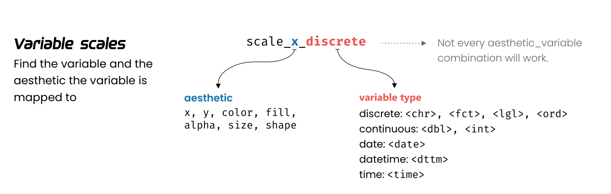

# 标度

```{r, message=FALSE, warning=FALSE}
library(tidyverse)
penguins <- palmerpenguins::penguins %>% drop_na()

penguins %>% 
  ggplot(aes(x = bill_length_mm, y = bill_depth_mm)) +
  geom_point(aes(colour = species))  
```

这个图还是挺漂亮的，那是因为ggplot2的默认配色已经很美观了。
然而，不是每个人都喜欢这种款式，好比不是人人都喜欢范冰冰一样。
好在 ggplot2 能让我们按照自己的想法进行调整。
因此，今天我们学习标度(scale)的概念。


**标度**是用于调整映射关系，具体来说就是调整**数据所映射的图形属性**。
比如，系统默认`"a"`对应红色，`"b"`对应蓝色，我们现在想让`"a"`对应紫色，`"b"`对应橙色。


## 丰富的标度体系

ggplot2中标度函数是由"_"分割的三个部分构成的，
```{r, echo = FALSE}

```

- scale
- 视觉属性名 (e.g., colour, shape or x)
- 标度名 (e.g., continuous, discrete, brewer, manual)


每个标度函数内部都有丰富的参数系统，下面，我们通过具体的案例讲解如何使用参数，把图形变成我们想要的模样。


# 位置标度

```{r}
penguins %>% 
  ggplot(aes(x = bill_length_mm, y = bill_depth_mm)) +
  geom_point(aes(color = species)) 
```


## 修改横坐标标题

```{r}
penguins %>% 
  ggplot(aes(x = bill_length_mm, y = bill_depth_mm)) +
  geom_point(aes(colour = species)) +
  scale_x_continuous(
    name = "这是我的横坐标"
  )
```

```{r}
penguins %>% 
  ggplot(aes(x = bill_length_mm, y = bill_depth_mm)) +
  geom_point(aes(colour = species)) +
  scale_x_continuous(
    name = "这是我的横坐标"
  ) +
  scale_y_continuous(
    name = "这是我的纵坐标"
  ) +
  labs(
    title = "这是我的标题"
  )
```


## 修改坐标轴范围

```{r}
penguins %>% 
  ggplot(aes(x = bill_length_mm, y = bill_depth_mm)) +
  geom_point(aes(colour = species)) +
  scale_x_continuous(
    limits = c(20, 70)
  )
```


## 修改坐标轴扩展范围

```{r}
penguins %>% 
  ggplot(aes(x = bill_length_mm, y = bill_depth_mm)) +
  geom_point(aes(colour = species)) +
  scale_x_continuous(
    limits = c(20, 70),
    expand = c(0, 0)
  )
```


```{r}
penguins %>% 
  ggplot(aes(x = bill_length_mm, y = bill_depth_mm)) +
  geom_point(aes(colour = species)) +
  scale_x_continuous(
    limits = c(20, 70),
    expand = c(0, NA)
  )
```

## 修改横坐标刻度为`c(30, 35, 40, 45, 50, 55, 60)`

这个坐标刻度，类似我们腰带皮带上打孔的意思。

可以很实诚地手动完成
```{r}
penguins %>% 
  ggplot(aes(x = bill_length_mm, y = bill_depth_mm)) +
  geom_point() +
  scale_x_continuous(
    limits = c(30, 60),
    breaks = c(30, 35, 40, 45, 50, 55, 60),
    expand = c(0, 0)
  )
```


也可以偷懒用函数

```{r}
penguins %>% 
  ggplot(aes(x = bill_length_mm, y = bill_depth_mm)) +
  geom_point() +
  scale_x_continuous(
    limits = c(30, 60),
    breaks = seq(from = 30, to = 60, by = 5),
    expand = c(0, 0)
  )
```


## 修改横坐标标签

让横坐标标签有单位（在皮带打孔的位置写上含义），比如`30mm, 35mm, 40mm, 45mm, 50mm, 55mm, 60mm`

你可能是一个很实诚的娃
```{r}
penguins %>% 
  ggplot(aes(x = bill_length_mm, y = bill_depth_mm)) +
  geom_point() +
  scale_x_continuous(
    limits = c(30, 60),
    breaks = c(30, 35, 40, 45, 50, 55, 60),
    labels = c("30mm", "35mm", "40mm", "45mm", "50mm", "55mm", "60mm")
  )
```

也可以使用柔软的函数
```{r}
penguins %>% 
  ggplot(aes(x = bill_length_mm, y = bill_depth_mm)) +
  geom_point() +
  scale_x_continuous(
    limits = c(30, 60),
    breaks = seq(from = 30, to = 60, by = 5), 
    labels = function(x) paste0(x, "_mm")
  )
```


当然最贴心的还是`scales::label_number()`

```{r}
# label_number() handles all numbering formatting
penguins %>% 
  ggplot(aes(x = bill_length_mm, y = bill_depth_mm)) +
  geom_point(aes(colour = species)) +
  scale_x_continuous(
    name = "这是我的横坐标",
    limits = c(30, 60),
    breaks = scales::breaks_width(width = 5),
    labels = scales::label_number(accuracy = 0.1, suffix = "mm")
  )
```


```{r}
penguins %>% 
  ggplot(aes(x = bill_length_mm, y = bill_depth_mm)) +
  geom_point(aes(colour = species)) +
  scale_x_continuous(
    limits = c(30, 60),
    labels = scales::label_number(accuracy = 1, prefix = "CNY")
  )
```


```{r}
penguins %>% 
  ggplot(aes(x = bill_length_mm, y = bill_depth_mm)) +
  geom_point(aes(colour = species)) +
  scale_x_continuous(
    limits = c(30, 60),
    labels = scales::label_percent(scale = 100, suffix = "%")
  ) 
```


**课堂练习**，

- 让上图的坐标变成百分号的形式(30  ->  30%)

- 让纵坐标的标签有单位，比如`12mm, 14mm, 16mm, 18mm, 20mm, 22mm`


# 颜色标度

```{r}
penguins %>% 
  ggplot(aes(x = bill_length_mm, y = bill_depth_mm)) +
  geom_point(aes(color = species)) 
```


## 使用自己喜欢的颜色

问题来了，颜色怎么对应各种企鹅呢？


我们指定三种颜色，默认按照 "Adelie", "Chinstrap", "Gentoo" 字母的顺序一一对应
(类似幼儿园的三个小朋友"Adelie", "Chinstrap", "Gentoo"，按照名字排排坐好了，我们按照座次发果果)


```{r}
penguins %>% 
  ggplot(aes(x = bill_length_mm, y = bill_depth_mm)) +
  geom_point(aes(colour = species)) +
  scale_color_manual(
    values = c("darkorange", "purple", "cyan4") 
  )
```


也可以让小朋友和颜色一一对应

```{r}
penguins %>%
  ggplot(aes(x = bill_length_mm, y = bill_depth_mm)) +
  geom_point(aes(colour = species)) +
  scale_color_manual(
    values = c(
      "Chinstrap" = "darkorange",
      "Gentoo"    = "purple",
      "Adelie"    = "cyan4"
    )
  )
```


也可以先 `breaks` 然后 `values`
```{r}
penguins %>% 
  ggplot(aes(x = bill_length_mm, y = bill_depth_mm)) +
  geom_point(aes(colour = species)) +
  scale_color_manual(
     breaks = c("Adelie", "Gentoo", "Chinstrap"), 
     values = c("darkorange", "purple", "cyan4")
  )
```

一一对应，清晰明了，非常工整


**课堂练习**，自己定义颜色吧 <https://www.color-hex.com/>或者
```{r}
colors()
```

```{r, eval=FALSE}
penguins %>% 
  ggplot(aes(x = bill_length_mm, y = bill_depth_mm)) +
  geom_point(aes(colour = species)) +
  scale_color_manual(
    values = c("Adelie" = "___",  "Chinstrap" = "___", "Gentoo" = "___")
  )
```


```{r}
penguins %>% 
  ggplot(aes(x = bill_length_mm, y = bill_depth_mm)) +
  geom_point(aes(colour = species)) +
  scale_color_manual(
    values = c("Adelie" = "chocolate4", "Chinstrap" = "goldenrod2", "Gentoo" = "cadetblue")
  )
```


## 使用自己喜欢的填充色

方法和上面一样

```{r}
penguins %>% 
   ggplot(aes(bill_length_mm, fill = species)) +
   geom_density(alpha = 0.6) +
   scale_fill_manual(
     breaks = c("Adelie", "Chinstrap", "Gentoo"), 
     values = c("darkorange", "purple", "cyan4")
  )
```


## 使用模板的颜色
```{r}
penguins %>%
  ggplot(aes(x = bill_length_mm, y = bill_depth_mm, color = species)) +
  geom_point(alpha = 0.6, size = 5) +
  scale_color_viridis_d()
```

```{r}
penguins %>%
  ggplot(aes(x = bill_length_mm, y = bill_depth_mm, color = species)) +
  geom_point(alpha = 0.6, size = 5) +
  scale_colour_viridis_d(option = "inferno")
```


## 连续的颜色

```{r}
penguins %>% 
  ggplot(aes(x = bill_length_mm, y = bill_depth_mm)) +
  geom_point(aes(color = body_mass_g))
```

```{r}
penguins %>% 
  ggplot(aes(x = bill_length_mm, y = bill_depth_mm)) +
  geom_point(aes(color = body_mass_g), alpha = 0.6, size = 5) +
  scale_color_viridis_c()
```


```{r}
penguins %>% 
  ggplot(aes(x = bill_length_mm, y = bill_depth_mm)) +
  geom_point(aes(color = body_mass_g)) +
  scale_color_gradient(low = "grey", high = "brown")
```


```{r}
penguins %>% 
  ggplot(aes(x = bill_length_mm, y = bill_depth_mm)) +
  geom_point(aes(fill = body_mass_g), shape = 21, size = 4) +
  scale_fill_distiller(palette = "Oranges",  direction = 1)
```


```{r}
penguins %>% 
  ggplot(aes(x = bill_length_mm, y = bill_depth_mm)) +
  geom_point(aes(fill = body_mass_g), shape = 21, size = 4) +
  scale_fill_distiller(palette = "YlGn", direction = 1) 
```


```{r}
penguins %>%
  ggplot(aes(x = bill_length_mm, y = bill_depth_mm, colour = body_mass_g)) +
  geom_point(alpha = 0.6, size = 5) +
  scale_color_binned(type = "viridis")
```


# 大小的标度

## 控制图中点的大小变化范围

```{r}
penguins %>% 
  ggplot(aes(x = bill_length_mm, y = bill_depth_mm)) +
  geom_point(aes(size = body_mass_g)) +
  scale_size(
     name = "企鹅体重",
     range = c(1, 10)
   )
```

这里`range = c(1, 10)`的意思，让体重值最小的点，半径为1；让体重值最大的点，半径为10.


# 技术汇总

```{r}
penguins %>% 
  ggplot(aes(x = bill_length_mm, y = bill_depth_mm)) +
  geom_point(aes(fill = body_mass_g, size = body_mass_g), shape = 21) +
  
  scale_x_continuous(
    limits = c(30, 60),
    labels = scales::label_percent(scale = 1, suffix = "%"),
    expand = c(0, NA)
  ) +
  scale_y_continuous(
    limits = c(12, 22),
    breaks = scales::breaks_width(width = 2),
    labels = scales::label_number(accuracy = 1, suffix = "mm")
  ) +
  scale_fill_distiller(palette = "Oranges", direction = 1)
```