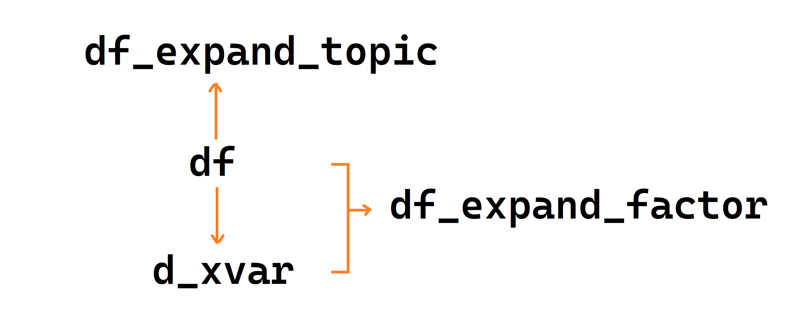

```{r setup, include=FALSE}
knitr::opts_chunk$set(
  echo       = TRUE,
  message    = FALSE,
  warning    = FALSE,
  out.width  = "100%",
  fig.asp    = 0.618, 
  fig.show   = "hold",
  fig.pos    = "center",
  fig.align  = "center",
  dpi        = 600
)

options(
  digits = 3,
  knitr.table.format = "html"
)
```


```{r, message=FALSE, warning=FALSE, echo = FALSE}
library(tidyverse)
library(readxl)
```


---
## 论文的思维导图


```{r, echo=FALSE}

```


---
## 提纲


<font size="6"> 

<span class="tab"></span> - 问卷介绍 <br>
<span class="tab"></span> - 导入数据 <br>
<span class="tab"></span> - 数据清洗及修改列名 <br>
<span class="tab"></span> - 人口特质 <br>
<span class="tab"></span> - 梳理变量层级 <br>
<span class="tab"></span> - 描述性统计 <br>
<span class="tab"></span> - 相关性分析 <br>
<span class="tab"></span> - 探索性因子分析 <br>
<span class="tab"></span> - 回归分析

</font> 


---
class: middle, center

# 问卷介绍


---
## 问卷设计： 5 + 18 + 13


```{r, echo=FALSE}

```

---
## 问卷结果汇总

```{r, echo=FALSE}

```


---
## 读入数据到R
```{r}
raw_data <- readxl::read_excel("./data/rawdata.xlsx")
raw_data 
```


---
## 数据清洗及修改列名

```{r, echo=FALSE, out.width= "65%"}

```


---
## 数据清洗及修改列名

```{r, echo=FALSE, out.width= "65%"}

```


---
## 得到清洗后的数据

我们得到重命名后的数据`df.rds`，此时它已存放在`data`文件夹中

```{r, echo=FALSE}
df <- read_rds("./data/df.rds")
```

```{r, echo=TRUE, eval=FALSE}
df <- read_rds("./data/df.rds")
df
```

```{r, echo=FALSE, eval=TRUE}
df %>%
  head(12) %>% 
  gt::gt()
```


---
## 规整的列名，可以大大提升分析的效率
```{r}
colnames(df)
```

---

.pull-left[

## 简单探索

检查每个变量中的类别数、缺失值、均值等


```{r, eval=FALSE}
library(modelsummary)

df %>%
  select(-id) %>% 
  datasummary_skim() #<<
```
]

--

.pull-right[
```{r, echo=FALSE}
library(modelsummary)

df %>%
  select(-id) %>% 
  modelsummary::datasummary_skim(
    type = "numeric",
    histogram = F,
    output = "gt"
  ) %>% 
  gt::tab_options(
    table.font.size = "80%"
  )
```

]


---
class: middle, center

# 一、人口特质

统计性别、年龄、教育程度、工作经历等变量中不同类别所占比例


---
## 性别信息


.pull-left[

```{r}
df %>%
  count(gender) %>% 
  mutate(gender = if_else(gender == 1, "male", "female")) %>% 
  mutate(prop = n / sum(n)) %>% 
  mutate(
    across(prop, scales::label_percent())
  )
```

]

--

.pull-right[
```{r}
library(gtsummary)

df %>%
  select(gender) %>% 
  mutate(gender = if_else(gender == 1, "male", "female")) %>%
  gtsummary::tbl_summary()  #<<
```

]


---

.pull-left[

## 汇聚成一张大表

```{r, eval=FALSE}
df %>%
  select(gender, age, educational_background) %>%
  mutate(gender = if_else(gender == 1, "male", "female")) %>%
  mutate(age = factor(age,
    labels = c(
      "1" = "under 25",
      "2" = "26-35",
      "3" = "36-45",
      "4" = "above 45"
    )
  )) %>%
  mutate(educational_background = factor(educational_background,
    labels = c(
      "1" = "high school diploma or below",
      "2" = "college degree",
      "3" = "bachelor degree",
      "4" = "graduate or above"
    )
  )) %>%
  tbl_summary() #<<
```

]

--

.pull-right[
<br>

```{r, echo=FALSE}
df %>%
  select(gender, age, educational_background) %>%
  mutate(gender = if_else(gender == 1, "male", "female")) %>%
  mutate(age = factor(age,
    labels = c(
      "1" = "under 25",
      "2" = "26-35",
      "3" = "36-45",
      "4" = "above 45"
    )
  )) %>%
  mutate(educational_background = factor(educational_background,
    labels = c(
      "1" = "high school diploma or below",
      "2" = "college degree",
      "3" = "bachelor degree",
      "4" = "graduate or above"
    )
  )) %>%
  tbl_summary()
```

]


---
class: middle, center

# 二、梳理变量层级

每个被访者在不同主题的平均得分


---
## 梳理变量层级

.pull-left[
以下是问卷设计的各**主题**

|  问卷   	|  主题设计  	|  变量           	|
|---------	|:-----------:|-----------------	|
| 列 7-10 	| 成就      	| `a_achievement_`  |
| 列11-13 	| 合作      	| `a_collectivity_` |
| 列14-18 	| 社交      	| `a_social_`       |
| 列19-21 	| 兴趣      	| `a_interest_`     |
| 列22-24 	| 规则      	| `a_rule_`         |
| 列25-37 	| 创造力    	| `b_`             	|

<br>
根据问卷结果，统计.red[每个人在每个主题的平均得分。]

]

.pull-right[
```{r}
colnames(df)
```
]


---
## 梳理变量层级

技术上讲就是，.red[**行方向**]求指定列的均值

```{r, echo=FALSE, out.width= "100%"}

```


--

推荐如下写法
```{r}
df_expand_topic <- df %>%
  rowwise() %>% #<<
  mutate(
    f_achievement  = mean(c_across(starts_with("a_achievement_"))),
    f_collectivity = mean(c_across(starts_with("a_collectivity_"))),
    f_social       = mean(c_across(starts_with("a_social_"))),
    f_interest     = mean(c_across(starts_with("a_interest_"))),
    f_rule         = mean(c_across(starts_with("a_rule_"))),
    creativity     = mean(c_across(starts_with("b_")))
  ) %>%
  ungroup() 
```


---
## 梳理变量层级

```{r, eval=FALSE}
df_expand_topic %>% 
  select(starts_with("f"), creativity)
```

```{r, echo=FALSE}
df_expand_topic %>% 
  select(starts_with("f"), creativity) %>% 
  head(12) %>% 
  gt::gt()
```


---
class: center, middle

# 三、描述性统计

统计相关变量的均值和方差等


---
## 描述性统计

统计某个变量的.red[**均值和方差**]，比如“成就认知 achievement”
.pull-left[
```{r}
df_expand_topic %>% 
  select(contains("achievement")) %>% 
  summarise(
    across(everything(), list(mean = mean, sd = sd))
  ) %>% 
  pivot_longer(
    cols = everything(),
    names_to = c("item", ".value"),
    names_pattern = "(.*)_(mean|sd)"
  )
  
```
]


--

.pull-right[

```{r}
df_expand_topic %>% 
  select(contains("achievement")) %>% 
  gtsummary::tbl_summary( #<<
    statistic = list(everything() ~ "{mean} ({sd})"),
    type = list(everything() ~ 'continuous')
  ) 
```

]


---
class: center, middle

# 四、推断性统计分析

检验不同类别的得分是否显著不同

---
## 单因素T检验

检验.red[**不同性别**]的得分是否存在显著差异，推荐使用 `rstatix` 宏包

<br>

```{r, echo=TRUE, eval=FALSE}
df_expand_topic %>% 
  mutate(gender = as.character(gender)) %>% 
  
  rstatix::t_test(total ~ gender) #<<
```

```{r, echo=FALSE}
df_expand_topic %>% 
  mutate(gender = as.character(gender)) %>% 
  rstatix::t_test(total ~ gender) %>% 
  gt::gt()
```


---
## 方差分析

.pull-left[

检验不同.red[**年龄组**]之间的得分是否存在显著差异

```{r, eval=FALSE}
df_expand_topic %>% 
  mutate(age = as.character(age)) %>% 
  
  rstatix::anova_test(total ~ age)  #<<
```

```{r, echo=FALSE}
df_expand_topic %>% 
  mutate(age = as.character(age)) %>% 
  rstatix::anova_test(total ~ age) %>% 
  gt::gt()
```
]

--

.pull-right[

```{r}
library(ggstatsplot)
df_expand_topic %>% 
  mutate(age = as.character(age)) %>% 
  ggbetweenstats( #<<
    x  = age,
    y  = total
 )
```
]


---
## 方差分析

.pull-left[

多个变量的统计表格汇总成一张大表，再次感受到 `gtsummary` 的贴心

```{r, echo=TRUE, eval=FALSE}
library(gtsummary)

df_expand_topic %>% 
  mutate(
    across(c(age:position_level), as.character)
  ) %>%
  select(age:position_level, total) %>% 
  
  gtsummary::tbl_uvregression( #<<
    method = aov,              #<<
    y = total                  #<<
  )                            #<<

```

]

--

.pull-right[
<br>
<br>
```{r, echo=FALSE, eval=TRUE}
library(gtsummary)

df_expand_topic %>% 
  mutate(
    across(c(age:position_level), as.character)
  ) %>%
  select(age:position_level, total) %>% 
  
  gtsummary::tbl_uvregression( 
    method = aov,              
    y = total,                 
    pvalue_fun = function(x) style_pvalue(x, digits = 3)
  ) 

```

]


---
class: center, middle
# 五、相关性分析

考察自变量及因变量之间的相关性

---
## 相关系数矩阵

我们考察18个自变量及因变量之间的相关性，使用 `rstatix` 宏包


```{r, eval=FALSE}
df %>%
  select(starts_with("a_"), creativity) %>%
  
  rstatix::cor_mat(method = "pearson") #<<
```


```{r, echo=FALSE}
df %>%
  select(starts_with("a_"), creativity) %>%
  rstatix::cor_mat(method = "pearson") %>% 
  gt::gt()
```


---
## 相关性分析

```{r, eval=FALSE}
library(ggstatsplot)

df %>%
  select(starts_with("a_"), creativity) %>%
  
  ggcorrmat(                #<<
    output      = "plot",
    matrix.type = "lower",
    type        = "parametric",
    sig.level   = 0.05,
    colors      = c("#E69F00", "white", "#009E73")
  ) 
```


---

```{r, echo=FALSE, out.width="100%", fig.asp=0.8, fig.width = 9}
df %>%
  select(starts_with("a_"), creativity) %>%
  ggcorrmat(
    output      = "plot",
    matrix.type = "lower",
    type        = "parametric",
    sig.level   = 0.05,
    colors      = c("#E69F00", "white", "#009E73")
  ) 
```


---
class: center, middle
# 六、探索性因子分析

数据降维：18个自变量变成少量的因子


---
## 探索性因子分析

.red[**自变量之间存在高度关联性，因为我们必须降维处理，提取公共因子**]。
在此之前，我们要先做数据标准化。

```{r}
d_xvar <- df %>% 
  mutate(
    across(starts_with("a_"), ~ (.x - mean(.x)/sd(.x)))
  ) %>% 
  select(starts_with("a_"))
```

```{r, echo=FALSE}
d_xvar %>% 
  head() %>% 
  gt::gt()
```

---
## 探索潜在因子

我们加载 `psych` 宏包，标准化之后的自变量表格(d_xvar)喂给函数 `fa.parallel()`，探索其中的潜在因子

```{r, fig.asp=0.8, echo=TRUE, eval=FALSE}
library(psych)
fa.parallel(d_xvar)
```


.pull-left[

```{r, fig.asp=0.8, results='hide', out.width= "100%", echo=FALSE}
library(psych)

fa.parallel(d_xvar)
```

]


.pull-right[
<br>
<br>
该图的横坐标反映的是各个因子，纵坐标对应各个因子的特征值，可以看出从第5个因子开始，它们的特征值几乎就没有变化了。所以从左图不难看出，选择4个因子是最佳的。事实上，`fa.parallel()`也推荐使用 `nfactors = 4`，即 4 个潜在因子。

]


---
## 因子分析

使用 `psych` 宏包的 `fa()` 函数来执行.red[**因子分析**]


```{r}
myfa <- d_xvar %>% 
  fa(nfactors = 5, rotate = "varimax", fm = "minres", scores = T)
```

<br>
这里特别说明，

- 为了保留更多的信息，让因子能解释大于80%的数据变化，指定 `nfactors = 5`，让模型给出5个潜在因子。

- 我们还指定旋转方法 `rotate = "varimax"`，表示希望对因子进行旋转，以便更容易解释因子结构。

- 指定计算方法 `fm = "minres"`。


---
## 因子载荷矩阵

.pull-left[
.red[**因子载荷矩阵**]，显示各变量与每个因子之间的相关性

```{r, echo=TRUE, eval=FALSE}
myfa$loadings %>% 
  unclass() %>% 
  as.data.frame() %>% 
  rownames_to_column("variables")
```

```{r, echo=FALSE}
myfa$loadings %>% 
  unclass() %>% 
  as.data.frame() %>% 
  rownames_to_column("variables") %>% 
  gt::gt() %>% 
  gt::tab_options(
    table.font.size = "80%"
  )
```

]


.pull-right[

```{r, eval=FALSE}
myfa %>% fa.diagram(digits = 3)
```

```{r, echo=FALSE, fig.asp=1, fig.align='right'}
myfa %>% 
  fa.diagram(digits = 3, rsize = 0.5, main = "每个变量对于每个因子的贡献程度")
```
]


---
## 因子解释的百分比

.red[**因子解释的百分比**]，显示每个因子可以解释的数据方差的百分比。

```{r, echo=TRUE, eval=FALSE}
myfa$Vaccounted %>% 
  as.data.frame() %>%  
  rownames_to_column("item")
```

```{r, echo=FALSE, eval=TRUE}
myfa$Vaccounted %>% 
  as.data.frame() %>%  
  rownames_to_column("item") %>% 
  flextable::flextable() %>% 
  flextable::autofit() %>% 
  flextable::bg( 
    i = ~ item == "Proportion Var", 
    bg = "orange", 
    part = "body"
  )
```


---
## 公共因子并入原数据框

```{r}
df_expand_factor <- myfa$scores %>% 
  as_tibble() %>% 
  bind_cols(df) %>%  #<<
  
  relocate(id, .before = MR2) %>% 
  rename(
    "Construction_of_Social_Relations" = MR1, 
    "Perception_of_Achievement"        = MR2,  
    "Personal_Preference"              = MR3,
    "Collective_Behaviors"             = MR4, 
    "Collective_Consciousness"         = MR5
  ) %>%
  rowwise() %>% 
  mutate(creativity = mean(c_across(cols = starts_with("b_")))) %>% 
  ungroup()

# df_expand_factor
```


---
## 此时的数据集 df_expand_factor

```{r, echo=FALSE}
df_expand_factor %>% 
  select(
    id, 
    Construction_of_Social_Relations, 
    Perception_of_Achievement,  
    Personal_Preference,
    Collective_Behaviors, 
    Collective_Consciousness,
    creativity
  ) %>% 
  head(10) %>% 
  flextable::flextable() %>% 
  flextable::fontsize(size = 9, part = "all") %>% 
  flextable::autofit()
```


---
class: center, middle
# 七、回归分析


---
## 线性模型

以个人特质变量和5个公共因子作为自变量，建立多元线性回归模型
<br>
<br>
$$
\begin{aligned}
\operatorname{creativity} = \alpha + & \beta_{1}(gender) + \beta_{2}(age) + \beta_{3}(educational\_background)\ + \\
& \beta_{4}(work\_experience) + \beta_{5}(position\_level) \ + \\
\\
& \beta_{6}(Perception\_of\_Achievement)\ + \\ 
& \beta_{7}(Construction\_of\_Social\_Relations)\ + \\
& \beta_{8}(Collective\_Consciousness)\ + \\
& \beta_{9}(Collective\_Behaviors) \ + \\ 
& \beta_{10}(Personal\_Preference) \ + \epsilon \\
\\
\epsilon \sim & \;\operatorname{normal}(0,\sigma)
\end{aligned}
$$


---
## 线性模型

```{r}
mod_linear <-
  lm(
    creativity ~ gender + age +
      educational_background +
      work_experience +
      position_level +

      Perception_of_Achievement +
      Construction_of_Social_Relations +
      Collective_Consciousness +
      Collective_Behaviors +
      Personal_Preference,
    
    data = df_expand_factor
  )

# summary(mod_linear)
```


---
## 线性模型的输出结果
```{r}
mod_linear %>% 
  gtsummary::tbl_regression() #<<
```


---
## 系数代入模型方程

<br>
<br>
<br>
$$
\begin{aligned}
\widehat{creativity} = 4.38 + \; & 0.02(gender) - 0.03(age) - 0.02(educational\_background)\ + \\
& 0.01(work\_experience) - 0.05(position\_level) \ + \\
\\
& 0.26(Perception\_of\_Achievement)\ + \\ 
& 0.35(Construction\_of\_Social\_Relations)\ + \\
& 0.35(Collective\_Consciousness)\ + \\
& 0.26(Collective\_Behaviors) \ + \\ 
& 0.28(Personal\_Preference)
\end{aligned}
$$


---
## 边际效应

画出边际效应图形

```{r, fig.asp=0.6, echo=TRUE, out.width= "80%", eval=FALSE}
library(marginaleffects)
library(patchwork)


p1 <- plot_predictions(mod_linear, condition = "Perception_of_Achievement")
p2 <- plot_predictions(mod_linear, condition = "Construction_of_Social_Relations")
p3 <- plot_predictions(mod_linear, condition = "Collective_Consciousness")
p4 <- plot_predictions(mod_linear, condition = "Collective_Behaviors")
p5 <- plot_predictions(mod_linear, condition = "Personal_Preference")


(p1 + p2 + p3 + p4 + p5) +
  plot_layout(ncol = 3)
```


---
## 边际效应

查看边际效应，最后给出理论解释

```{r, fig.asp=0.6, echo=FALSE, out.width= "80%"}
library(marginaleffects)
library(patchwork)

theme_set(
  theme_gray() + 
  theme(axis.title = element_text(size = rel(0.8)))
)

p1 <- plot_predictions(mod_linear, condition = "Perception_of_Achievement")
p2 <- plot_predictions(mod_linear, condition = "Construction_of_Social_Relations")
p3 <- plot_predictions(mod_linear, condition = "Collective_Consciousness")
p4 <- plot_predictions(mod_linear, condition = "Collective_Behaviors")
p5 <- plot_predictions(mod_linear, condition = "Personal_Preference")

(p1 + p2 + p3 + p4 + p5) +
  plot_layout(ncol = 3)
```


---
## 数据分析的流动

通过数据框的转换和两次扩展，看数据分析的流动和方向

```{r, echo=FALSE, out.width= "90%"}

```


---
class: center, middle

# [**感谢 R 语言之美!**]()

<br>

| 主题     	| 需要掌握的宏包                            	   |
|:---------	|:-----------------------------------------------|
| 数据处理 	| dplyr                                     	   |
| 可视化   	| ggplot2                                   	   |
| 建模     	| lm()/glm(), rstatix, psych, marginaleffects  	 |
| 写作     	| Rmarkdown, flextable, gtsummary, modelsummary  |


